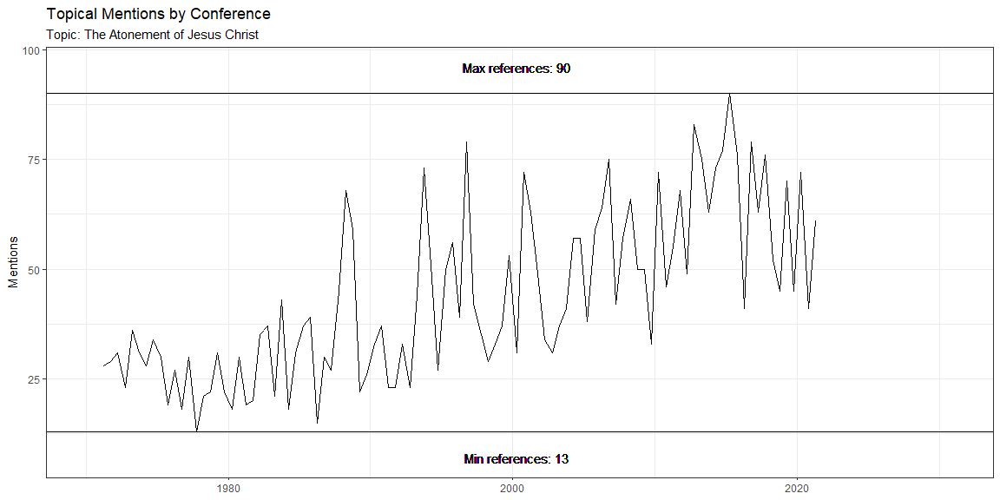

## Background

For my Apostle Practicum, I wanted to see how topics have been addressed by our Prophets and Apostles over time. Being a CIT major, I used some of the skills I have learned in my other classes to create visualizations expressing the usage of certain words surrounding each of the following topics over the years. Under each topic, I have also included some of my favorite quotes about each topic from the current First Presidency and Twelve Apostles of the church. Scroll or click through the topics below to see my findings!

## Charity and Ministering

### Visualizations


```r
charity <- 'charity|pure love|compassion|love of god|service|ministering'
hist_charity <- charity %>% wc() %>% conf_count()
plot_conf(hist_charity, "Charity and Ministering")
```

<!-- -->

```r
ap_charity <- charity %>% apostles()
ap_plot(ap_charity, "Charity and Ministering")
```

<!-- -->

### Quotes

> “When the **love of God sets the tone for our own lives**, for our relationships to each other and ultimately our feeling for all humankind, then old distinctions, limiting labels, and artificial **divisions begin to pass away, and peace increases.**”\n
>
> <footer>The Greatest Possession- Elder Jeffrey R. Holland, October 2021</footer>

> “To have peaceful relationships, the lesson is clear: we should be willing to **compromise and eliminate strife with respect to matters that do not involve righteousness**.”
>
> <footer>Personal Peace in Challenging Times- Elder Quentin L. Cook, October 2021</footer>

> “Those who serve others **will not** sleep through the Restoration.”
>
> <footer>Are You Sleeping through the Restoration?- President Dieter F. Uchtdorf, April 2014</footer>

> “Brethren, we as priesthood bearers have committed to be a people who love God and our neighbor and who are willing to demonstrate that love through word and deed. **That is the essence of who we are** as disciples of Jesus Christ.”
>
> <footer>Are You Sleeping through the Restoration?- President Dieter F. Uchtdorf, April 2014</footer>


> “Those who reached out felt the love of the Savior for this family and **acted as His hands in serving them.**”
>
> <footer>Simply Beautiful, Beautifully Simple- Elder Gary E. Stevenson, October 2021</footer>


> “**Unity requires effort.** It develops when we cultivate the love of God in our hearts and we focus on our eternal destiny. We are united by our common, primary identity as children of God and our commitment to the truths of the restored gospel. In turn, our love of God and our discipleship of Jesus Christ generate genuine concern for others. We value the kaleidoscope of others’ characteristics, perspectives, and talents. If we are unable to place our discipleship to Jesus Christ above personal interests and viewpoints, we should reexamine our priorities and change.”
>
> <footer>The Peace of Christ Abolishes Enmity- Elder Dale G. Renlund, October 2021</footer>


> “The Finns were no less Finnish; the Russians were no less Russian; neither group abandoned their culture, history, or experiences to banish enmity. They did not need to. Instead, **they chose to make their discipleship of Jesus Christ their primary consideration.**”
>
> <footer>The Peace of Christ Abolishes Enmity- Elder Dale G. Renlund, October 2021</footer>


> “Here is the solution for our incessantly quarrelsome times—**the love of God.**”
>
> <footer>The Love of God- Elder D. Todd Christofferson, October 2021</footer>


> “The expression of compassion for others is, in fact, the essence of the gospel of Jesus Christ and a **marked evidence of our spiritual and emotional closeness to the Savior.**”
>
> <footer>The Savior’s Abiding Compassion- Elder Ulisses Soares, October 2021</footer>


> “My dear friends, as we intentionally strive to incorporate a compassionate attitude into our way of life, as exemplified by the Savior, we will become more sensitive to people’s needs. With that increased sensitivity, **feelings of genuine interest and love will permeate our every action.**”
>
> <footer>The Savior’s Abiding Compassion- Elder Ulisses Soares, October 2021</footer>


### Position Statement

There are people who are all around us who are in need of help. President Eyring said a few conferences ago that if we always assume that people we interact with are in need or distress, we will be right over 50% of the time. As we pray for the love of God in our hearts and channel that love into the selfless service of others, we will be blessed with a greater understanding of those people whom we serve and we can see them in God’s eyes.

### Personal Application

This semester, I chose to focus on growing my charity for others. As I have done so, I have been immensely blessed by the service I have performed. One such example in my life has come about as I sought to serve one of my classmates and former ward members. When my wife and I first moved into our student ward, this person was my elders’ quorum instructor. One Sunday, with some emotion in his voice, he reminded us to show our love and devotion to our wives each day. I noticed that each Sunday after that, he would come to wife alone, without his wife. Eventually he stopped showing up altogether. At the start of this semester, he walked into one of my classes as a fellow student and I was happy to see him. I asked him about his church attendance and he confirmed my fear- his wife had divorced him and he was now attending a singles ward. 

He has really struggled this semester with insomnia and deep feelings of loneliness. Although he is usually a very strong and good student, these obstacles effected his class attendance for the class we share. Over the semester, I have sought to serve him by taking good notes in class and also by spending time with him outside of class and inviting him to social gatherings. As I have done so, I have been immensely blessed. I have grown great appreciation for this person and have been able to understand, in part, the great love the Lord has for him during this difficult time in his life. I have also gained a long-time friend from these experiences, as I have discovered that we have a lot in common and quite enjoy spending time together.

I know that the promised blessings of charity are real. I know that the Lord desires for us to be his hands and feet in serving our brothers and sisters, and that as we do so, we will be blessed beyond measure. I am grateful for the opportunity I have had to grow and change as I have sought to exercise charity and compassion this semester, and I plan to continue these practices throughout my life. I know that as I do so I will become a better disciple or Christ and my own life will be blessed by the people I serve.

## The Atonement of Jesus Christ

### Visualizations


```r
atonement <- 'atonement|atone|atoning|redeem'
hist_atonement <- atonement %>% wc() %>% conf_count()
plot_conf(hist_atonement, "The Atonement of Jesus Christ")
```

<!-- -->

```r
ap_atonement <- atonement %>% apostles()
ap_plot(ap_atonement, "The Atonement of Jesus Christ")
```

<!-- -->

### Quotes

> “Our only hope for true perfection is in receiving it as a gift from heaven—we can’t “earn” it. Thus, **the grace of Christ offers us not only salvation from sorrow and sin and death but also salvation from our own persistent self-criticism.**”
>
> <footer>Be Ye Therefore Perfect—Eventually- Elder Jeffrey R. Holland, October 2017</footer>


> “Our Savior’s Atonement reclaims us from death and, subject to our repentance, saves us from sin. With that worldview, Latter-day Saints have **distinctive priorities and practices** and are **blessed with the strength to endure** the frustrations and pains of mortal life.”
>
> <footer>The Plan and the Proclamation- Elder Dallin H. Oaks, October 2017</footer>


> “Christ’s advocacy is, at least in part, to remind us that He has paid for our sins and that **no one is excluded from the reach of God’s mercy**. For those who believe in Jesus Christ, repent, are baptized, and endure to the end—a process that leads to reconciliation—the Savior forgives, heals, and advocates. **He is our helper, consoler, and intercessor**—attesting to and vouching for our reconciliation with God.“
>
> <footer>Choose You This Day- Elder Dale G. Renlund, October 2018</footer>


> “No matter how long we have been off the path or how far away we have wandered, **the moment we decide to change, God helps us return**. From God’s perspective, through sincere repentance and pressing forward with a steadfastness in Christ, once back on the path, it will be as if we were never off. The Savior pays for our sins and frees us from the looming decrease in happiness and blessings.” 
>
> <footer>Choose You This Day- Elder Dale G. Renlund, October 2018</footer>


> “We don’t have to attempt the impossible in trying to rationalize our sins away. And on the other hand, we don’t have to attempt the impossible in erasing the effects of sin by our own merit alone. **Ours is not a religion of rationalization nor a religion of perfectionism but a religion of redemption—redemption through Jesus Christ**.”
>
> <footer>The Love of God- Elder D. Todd Christofferson, October 2021</footer>


> “Christ died not to save indiscriminately but to offer repentance. We rely ‘wholly upon the merits of him who is mighty to save’ in the process of repentance, but **acting to repent is a self-willed change**. So by making repentance a condition for receiving the gift of grace, God enables us to retain responsibility for ourselves.”
>
> <footer>Free Forever, to Act for Themselves- Elder D. Todd Christofferson, October 2014</footer>


> “I invite all to trust in the merits and in the power of the Atonement of Jesus Christ. **Through His atoning sacrifice, we can gain the courage to win all the wars of our time**, even in the midst of our difficulties, challenges, and temptations. Let us trust in His love and power to save us.”
>
> <footer>Yes, We Can and Will Win!- Elder Ulisses Soares, April 2015</footer>


> “Unlike you and me, **Christ is capable of clearly seeing all facets of a given situation**. Even knowing all our weaknesses as He does, the Savior does not rashly condemn us but continues to work with us compassionately over time, helping us to remove the beam from our eye.”
>
> <footer>The Savior’s Abiding Compassion- Elder Ulisses Soares, October 2021</footer>


> “When trust is betrayed, dreams shattered, hearts broken and broken again, when we want justice and need mercy, when our fists clench and our tears flow, when we need to know what to hold onto and what to let go of, **we can always remember Him**.”
>
> <footer>Always Remember Him- Elder Gerrit W. Gong, April 2016</footer>


> “When we are heavy laden with mistakes, heartaches, feelings of inadequacy, disappointment, anger, or sin, **the power of the Savior’s Atonement is, by divine design, one of the things that lifts the soul**.”
>
> <footer>The Things of My Soul- Elder Ronald A. Rasband, October 2021</footer>


### Position Statement

These quotes on the Atonement exhibit the Savior’s deep and abiding love for each of His children. We are never too far gone. Also, the Atonement enables us to face the challenges of the day. I am so grateful for our Savior, Jesus Christ, and for his sacrifice by which all of us can return to our Heavenly Father. I am also grateful for living prophets and apostles who can simply yet powerfully bear personal witness of Him, which can then be born by the Spirit into each of our hearts.

## Eternal Families

### Visualizations


```r
family <- 'family|parents|children|families|familial'
hist_family <- family %>% wc() %>% conf_count()
plot_conf(hist_family, "Eternal Families")
```

<!-- -->

```r
ap_family <- family %>% apostles()
ap_plot(ap_family, "Eternal Families")
```

<!-- -->

### Quotes

> “**A family council**, when conducted with love and with Christlike attributes, **will counter the impact of modern technology** that often distracts us from spending quality time with each other and also tends to bring evil right into our homes.”
>
> <footer>Family Councils- Elder M. Russell Ballard, April 2016</footer>


> “Those who do not believe in or aspire to exaltation and are most persuaded by the ways of the world consider this family proclamation as just a statement of policy that should be changed. In contrast, **Latter-day Saints affirm that the family proclamation defines the kind of family relationships where the most important part of our eternal development can occur.**”
>
> <footer>The Plan and the Proclamation- Elder Dallin H. Oaks, October 2017</footer>


> “The inspiration identifying the need for a proclamation on the family came to the leadership of the Church over 23 years ago. **It was a surprise to some who thought the doctrinal truths about marriage and the family were well understood without restatement. Nevertheless, we felt the confirmation and we went to work.** Subjects were identified and discussed by members of the Quorum of the Twelve for nearly a year. Language was proposed, reviewed, and revised. Prayerfully we continually pleaded with the Lord for His inspiration on what we should say and how we should say it. We all learned “line upon line, precept upon precept,” as the Lord has promised.”
>
> <footer>The Plan and the Proclamation- Elder Dallin H. Oaks, October 2017</footer>


> “**Generations are affected** by the choices we make.”
>
> <footer>Lest Thou Forget- Elder Ronald A. Rasband, October 2016</footer>


>	“As I matured and began to understand the magnificence of Heavenly Father’s plan, I often said to myself, ‘**I don’t want one more Christmas present! I just want to be sealed to my parents.**’ That longed-for event did not happen until my parents were past 80, and then it did happen. I cannot fully express the joy that I felt that day, and each day I feel that joy of their sealing and my being sealed to them.”
>
> <footer>Revelation for the Church, Revelation for Our Lives- President Russell M. Nelson, April 2018</footer>


>	“**The institution of the family is the foundation for both happiness and peace.**”
>
> <footer>Personal Peace in Challenging Times- Elder Quentin L. Cook, October 2021</footer>


>	“Meaningful growth occurs going **backward and forward through the generations** as sealing ordinances weld families together.” 
>
> <footer>Family History and Temple Work: Sealing and Healing- Elder Dale G. Renlund, April 2018</footer>


>	“Family histories, family traditions, and family ties **help us savor remembrance of things past** while **providing future patterns and hope.**”
>
> <footer>Always Remember Him- Elder Gerrit W. Gong, April 2016</footer>


>	“**Share your testimony with your family**; encourage them to remember how they felt when they recognized the Spirit in their lives and to record those feelings in journals and personal histories so that their own words may, when needed, bring to their remembrance how good the Lord has been to them.”
>
> <footer>Lest Thou Forget- Elder Ronald A. Rasband, October 2016</footer>


>	“We all need associations with others, and church associations are some of the best we can experience, for us and our companions and children. **Without those associations**, especially between children and faithful parents, **research shows increasing difficulty for parents to raise children in their faith.**”
>
> <footer>The Need for a Church- President Dallin H. Oaks, October 2021</footer>


### Position Statement

The link between families and Heavenly Father’s plan is very strong. The Lord wants each of his children to return to Him, and He has given us families as the most basic and powerful unit by which we can do so. As I have been married, I have learned that there are sacred experiences that occur within the family unit which teach, edify, and uplift in ways that cannot be experienced in any other way. I was also impressed as I read Elder Oaks’ remarks about the coming forth of the Family Proclamation. The simple truths related to the family and its sanctity are vital to our spiritual survival in today’s confusing social climate. While the world has degraded its own definition of family happiness, the apostles are here to stand firm in defending the doctrine of the family. 

## The Gathering of Israel

### Visualizations


```r
israel <- 'israel|gathering|covenant|mission|temple|family history|salvation'
hist_israel <- israel %>% wc() %>% conf_count()
plot_conf(hist_israel, "The Gathering of Israel")
```

<!-- -->

```r
ap_israel <- israel %>% apostles()
ap_plot(ap_israel, "The Gathering of Israel")
```

<!-- -->

### Quotes

>	“There has never been a time in the history of the world when **knowledge of our Savior is more personally vital and relevant to every human soul**. Imagine how quickly the devastating conflicts throughout the world—and those in our individual lives—would be resolved if we all chose to follow Jesus Christ and heed His teachings.”
>
> <footer>Pure Truth, Pure Doctrine, and Pure Revelation- President Russell M. Nelson, October 2021</footer>


>	“**Will [temple sealing] make a difference? Only if you want to progress forever and be together forever.** Wishing to be together forever will not make it so. No other ceremony or contract will make it so.”
>
> <footer>The Temple and Your Spiritual Foundation- President Russell M. Nelson October 2021</footer>


>	“Everything we believe and every promise God has made to His covenant people **come together in the temple.**”
>
> <footer>The Temple and Your Spiritual Foundation- President Russell M. Nelson, October 2021</footer>


>	“Even an unbelieving world will recognize The Church of Jesus Christ of Latter-day Saints and **realize the power of God upon it.** Faithful and brave disciples will fearlessly, humbly, and openly take upon them the name of Christ in their everyday lives.”
>
> <footer>Prayers of Faith- President Henry B. Eyring, April 2020</footer>


>	“If you don’t yet love to attend the temple, **go more often—not less.**”
>
> <footer>The Temple and Your Spiritual Foundation- President Russell M. Nelson, October 2021</footer>


>	“Helping individuals to experience the **mighty change of heart** and **bind themselves to the Lord** through sacred covenants and ordinances are the fundamental objectives of preaching the gospel.”
>
> <footer>With the Power of God in Great Glory- Elder David A. Bednar, October 2021</footer>


>	“[C]ovenants, entered into through authoritative priesthood ordinances, can bind us to the Lord Jesus Christ and are the **essential core** of the work of salvation and exaltation **on both sides of the veil.**”
>
> <footer>With the Power of God in Great Glory- Elder David A. Bednar, October 2021</footer>


>	“If you have prayed for any of these blessings, **participate in family history and temple work.** As you do so, your prayers will be answered. When ordinances are performed on behalf of the deceased, God’s children on earth are healed.”
>
> <footer>Family History and Temple Work: Sealing and Healing- Elder Dale G. Renlund, April 2018</footer>


>	“When our time in mortality is complete, **what experiences will we be able to share about our own contribution to this significant period of our lives and to the furthering of the Lord’s work?** Will we be able to say that we rolled up our sleeves and labored with all our heart, might, mind, and strength? Or will we have to admit that our role was mostly that of an observer?”
>
> <footer>Are You Sleeping through the Restoration?- President Dieter F. Uchtdorf, April 2014</footer>


>	“**Nothing opens the heavens quite like** the combination of increased purity, exact obedience, earnest seeking, daily feasting on the words of Christ in the Book of Mormon, and **regular time committed to temple and family history work.**”
>
> <footer>Revelation for the Church, Revelation for Our Lives- President Russell M. Nelson, April 2018</footer>


### Position Statement

From these quotes, I learned a few things. First, the Church of Jesus Christ stands as a beacon of truth to both the living and the dead. The Gospel of Jesus Christ is true, and the Spirit which accompanies it will bring people unto Jesus Christ, even when we are worried that our personal efforts aren’t good enough. Second, there is immense power in temple and family history work. While this work is vitally important for those deceased people for whom it is performed, the blessings of this work are immense for those who perform it. The antidote to many of todays ailments is looking outward and helping God’s children on both sides of the veil.

## Prayer and Personal Revelation

### Visualizations


```r
revelation <- 'revelation|seek|search|ponder|pray'
hist_revelation <- revelation %>% wc() %>% conf_count()
plot_conf(hist_revelation, "Prayer and Personal Revelation")
```

<!-- -->

```r
ap_revelation <- revelation %>% apostles()
ap_plot(ap_revelation, "Prayer and Personal Revelation")
```

<!-- -->

### Quotes

>	“Revelation comes to us **in proportion to the degree to which we have sought to take the doctrine of Christ into our hearts** and implement it in our lives.”
>
> <footer>The Faith to Ask and Then to Act- President Henry B. Eyring, October 2021</footer>


>	**If most of the information you get comes from social or other media, your ability to hear the whisperings of the Spirit will be diminished.** If you are not also seeking the Lord through daily prayer and gospel study, you leave yourself vulnerable to philosophies that may be intriguing but are not true. Even Saints who are otherwise faithful can be derailed by the steady beat of Babylon’s band.”
>
> <footer>Make Time for the Lord- President Russell M. Nelson, October 2021</footer>


>	“[W]hat will your seeking open for you? What wisdom do you lack? What do you feel an urgent need to know or understand? Follow the example of the Prophet Joseph. Find a quiet place where you can regularly go. Humble yourself before God. Pour out your heart to your Heavenly Father. Turn to Him for answers and for comfort. Pray in the name of Jesus Christ about your concerns, your fears, your weaknesses—yes, the very longings of your heart. And then listen! Write the thoughts that come to your mind. Record your feelings and follow through with actions that you are prompted to take. **As you repeat this process day after day, month after month, year after year, you will ‘grow into the principle of revelation.’**”
>
> <footer>Revelation for the Church, Revelation for Our Lives- President Russell M. Nelson, April 2018</footer>


>	“Our Savior and Redeemer, Jesus Christ, will perform some of His mightiest works between now and when He comes again. We will see miraculous indications that God the Father and His Son, Jesus Christ, preside over this Church in majesty and glory. But in coming days, **it will not be possible to survive spiritually without the guiding, directing, comforting, and constant influence of the Holy Ghost.**”
>
> <footer>Revelation for the Church, Revelation for Our Lives- President Russell M. Nelson, April 2018</footer>


>	“The way to receive revelation from God has not changed from the days of Adam and Eve. It has been the same for all called servants of the Lord from the beginning to the present day. It is the same for you and me. **It is always done by exercising faith.**”
>
> <footer>The Faith to Ask and Then to Act- President Henry B. Eyring, October 2021</footer>


>	“When I pray with faith, **I have the Savior as my advocate with the Father and I can feel that my prayer reaches heaven.** Answers come. Blessings are received. There is peace and joy even in hard times.”
>
> <footer>Prayers of Faith- President Henry B. Eyring, April 2020</footer>


>	“Addressing honest questions is an important part of building faith, and we use both our intellect and our feelings. The Lord said, ‘I will tell you in your mind and in your heart.’ **Not all answers will come immediately, but most questions can be resolved through sincere study and seeking answers from God.**”
>
> <footer>Faith Is Not by Chance, but by Choice- Elder Neil L. Anderson, October 2015</footer>


>	“As Brother Jens prays each morning for help to recognize promptings from the Holy Ghost, even something as unusual as to immediately change a light bulb, he also prays that he can be used as a tool to bless God’s children. **Jens lives the gospel by seeking divine direction each day, striving to be worthy, then doing his best to follow that direction when it comes**.”
>
> <footer>Simply Beautiful, Beautifully Simple- Elder Gary E. Stevenson, October 2021</footer>


>	“This divine love should give us abundant comfort and confidence as we pray to the Father in the name of Christ. **Not one of us is a stranger to Them.** We need not hesitate to call upon God, even when we feel unworthy. We can rely on the mercy and merits of Jesus Christ to be heard.”
>
> <footer>The Love of God- Elder D. Todd Christofferson, October 2021</footer>


>	“We know continuing revelation and inspiration **fit unchanging truth to changing circumstances.**”
>
> <footer>Trust Again- Elder Gerrit W. Gong, October 2021</footer>


### Position Statement

I chose this topic because I felt like I was really lacking in my prayers and personal revelation. As I studied the words of the prophets, I learned a lot about how I can make a personal connection with heaven each day. One of the things that permeates these quotes is the love of God. That love is exhibited as we pray for others and receive revelation about ways in which we can love and serve them. Another powerful aspect of personal revelation is the confirming witness of the Holy Ghost. I have been overwhelmed by that witness as I read the words of the prophets. My testimony of living prophets and their vitality has grown immensely. I am proud to be a part of the Church of Jesus Christ and to not only receive personal revelation, but to have prophets and apostles to look to who can lead and guide the Church to safety and peace through revelation which they receive. 

## Obedience and Happiness

### Visualizations


```r
obedience <- 'obedience|commandments|happiness|joy|obey|exact|follow'
hist_obedience <- obedience %>% wc() %>% conf_count()
plot_conf(hist_obedience, "Obedience and Happiness")
```

<!-- -->

```r
ap_obedience <- obedience %>% apostles()
ap_plot(ap_obedience, "Obedience and Happiness")
```

<!-- -->

### Quotes

>	“If we cease valuing our churches for any reason, we threaten our personal spiritual life, and significant numbers **separating themselves from God reduce His blessings to our nations.**”
>
> <footer>The Need for a Church- President Dallin H. Oaks, October 2021</footer>


>	“These two scriptures also teach that to return to Their presence we need to believe. We need to believe in Jesus and in God’s plan of happiness. **To believe is to love and follow our Savior and keep the commandments**, even in the midst of trials and strife.”
>
> <footer>“Lovest Thou Me More Than These?”- President M. Russell Ballard, October 2021</footer>


>	“We must always remember that our true happiness depends upon **our relationship with God, with Jesus Christ, and with each other.**”
>
> <footer>“Lovest Thou Me More Than These?”- President M. Russell Ballard, October 2021</footer>


>	“On conduct relating to righteousness and doctrinal imperatives, we need to remain firm and steadfast. **If we want to have the peace which is the reward of the works of righteousness, we will not pitch our tents toward the world. We will pitch our tents toward the temple.**”
>
> <footer>Personal Peace in Challenging Times- Elder Quentin L. Cook, October 2021</footer>


>	“[T]he storms and temptations of this life are often unpredictable. But this we know: they will come! In order to overcome the challenges and temptations that each of us inevitably faces, it will require righteous preparation and the use of divinely provided protections. **We must determine to be temple worthy regardless of what befalls us. If we are prepared, we shall not fear.**”
>
> <footer>Shipshape and Bristol Fashion: Be Temple Worthy—in Good Times and Bad Times- Elder Quentin L. Cook, October 2015</footer>


>	“Let us go forward in faith. When we **willingly follow** the counsel of the Lord as revealed through His living prophet, **especially if it runs counter to our initial thinking**, requiring humility and sacrifice, **the Lord blesses us with additional spiritual power** and sends His angels to support us and stand by us.”
>
> <footer>The Name of the Church Is Not Negotiable- Elder Neil L. Anderson, October 2021</footer>


>	“My dear friends, your faith did not begin at birth, and it will not end at death. **Faith is a choice. Strengthen your faith**, and live to be deserving of the Savior’s approving words: ‘Great is thy faith.’ As you do, I promise you that your faith, through the grace of Jesus Christ, will one day allow you to stand with those you love, clean and pure in the presence of God.”
>
> <footer>Faith Is Not by Chance, but by Choice- Elder Neil L. Anderson, October 2015</footer>


>	“We are distinguished as a Church to be led by prophets, seers, and revelators called of God for this time. **I promise that as you listen and follow their counsel, you will never be led astray. Never!**”
>
> <footer>The Things of My Soul- Elder Ronald A. Rasband, October 2021</footer>


>	“[T]his statement by C. S. Lewis resonated with me: “[Mortals] say of some temporal suffering, ‘No future bliss can make up for it,’ not knowing that Heaven, once attained, will work backwards and turn even that agony into a glory. … **The Blessed will say, ‘We have never lived anywhere except in Heaven.’**”
>
> <footer>Family History and Temple Work: Sealing and Healing- Elder Dale G. Renlund, April 2018</footer>


>	“The most important words we can hear, ponder, and follow **are those revealed through our living prophet**.”
>
> <footer>The Things of My Soul- Elder Ronald A. Rasband, October 2021</footer>


### Position Statement

I have always been fascinated by the correlation between obedience to God’s laws and personal peace and happiness. From these quotes, I learned that obedience is a matter of decision that strongly correlates with your attitude. Obedience will not only bring the blessings associated with the commandments, but the very act of willing obedience can greatly change one’s heart for the better. The study of obedience is also a strong witness of the words of the prophets. I love what Elder Rasband said about how if we obey the words of the prophets (the words of God), we will never be lead astray. This has greatly increased my confidence in the prophets, as well as my personal peace despite the craziness of the world today.

## Agency and Accountability

### Visualizations


```r
agency <- 'agency|accountable|accountability|agent|choose|choice'
hist_agency <- agency %>% wc() %>% conf_count()
plot_conf(hist_agency, "Agency and Acountability")
```

<!-- -->

```r
ap_agency <- agency %>% apostles()
ap_plot(ap_agency, "Agency and Accountability")
```

<!-- -->

### Quotes

>	“Our Heavenly Father’s goal in parenting is not to have His children do what is right; it is to have His children choose to do what is right and ultimately become like Him. If He simply wanted us to be obedient, He would use immediate rewards and punishments to influence our behaviors. But **God is not interested in His children just becoming trained and obedient “pets”** who will not chew on His slippers in the celestial living room. No, **God wants His children to grow up spiritually and join Him in the family business.**”
>
> <footer>Choose You This Day- Elder Dale G. Renlund, October 2018</footer>


>	“It is His plan and His will that **we have the principal decision-making role in our own life’s drama**. God will not live our lives for us nor control us as if we were His puppets, as Lucifer once proposed to do. Nor will His prophets accept the role of “puppet master” in God’s place.”
>
> <footer>Free Forever, to Act for Themselves- Elder D. Todd Christofferson, October 2014</footer>


>	“Resenting the law of gravity won’t keep a person from falling if he steps off a cliff. The same is true for eternal law and justice. **Freedom comes not from resisting it but from applying it. That is fundamental to God’s own power.**”
>
> <footer>Free Forever, to Act for Themselves- Elder D. Todd Christofferson, October 2014</footer>


>	“Because [Heavenly Father and Jesus Christ] love you, They do not want to leave you ‘just as you are.’ Because They love you, They want you to have joy and success. Because They love you, They want you to repent because that is the path to happiness. But **it is your choice—They honor your agency. You must choose to love Them, to serve Them, to keep Their commandments.** Then They can more abundantly bless you as well as love you.”
>
> <footer>The Love of God- Elder D. Todd Christofferson, October 2021</footer>


>	“You no longer stand on neutral ground. **Your faith will grow not by chance, but by choice**. How we live our lives increases or diminishes our faith. Prayer, obedience, honesty, purity of thought and deed, and unselfishness increase faith. Without these, faith diminishes.”
>
> <footer>Faith Is Not by Chance, but by Choice- Elder Neil L. Anderson, October 2015</footer>


>	“**Most of the changes in our spiritual lives—both positive and negative—happen gradually, a step at a time.** Like the participants in the Max Planck study, we may not realize when we veer off course. We may even have high confidence that we are walking a straight line. But the fact is that without the help of landmarks to guide us, we inevitably deviate off course and end up in places we never thought we would be.”
>
> <footer>Daily Restoration- Elder Dieter F. Uchtdorf, October 2021</footer>


>	“[I]t ultimately is impossible for another person to offend you or to offend me. Indeed, believing that another person offended us is fundamentally false. **To be offended is a choice we make; it is not a condition inflicted or imposed upon us** by someone or something else.”
>
> <footer>And Nothing Shall Offend Them- Elder David A. Bednar, October 2006</footer>


>	“Remember, **what you do, where you go, and what you see will shape who you become.** Who do you want to become? Become a worthy deacon, a worthy teacher, a worthy priest. Set a goal to be worthy to enter the temple now and to be worthy to receive your next ordinance at the proper age and ultimately to receive the Melchizedek Priesthood. This is a pathway of righteousness which invites divine assistance. The Lord stated, ‘In the ordinances thereof, the power of godliness is manifest.’”
>
> <footer>Be Valiant in Courage, Strength, and Activity- Elder Gary E. Stevenson, October 2012</footer>


>	“Being a disciple of Jesus Christ is not an effort of once a week or once a day. **It is an effort of once and for all.**”
>
> <footer>Are You Sleeping through the Restoration?- President Dieter F. Uchtdorf, April 2014</footer>


>	“[I]t is essential to understand that **[Satan and his servants] will have power over us only if we allow it.**”
>
> <footer>Yes, We Can and Will Win!- Elder Ulisses Soares, April 2015</footer>


### Position Statement

Agency is a powerful blessing from God, and is associated strongly with the laws of God as well. That is one thing that the prophets mention time and again, yet the world seems to forget. Agency is not the ability to decide your consequences, but a decision to follow the rules knowing the consequences. Free agency allows us to believe in a just God whose commandments have associated blessings or consequences. Our agency allows us to access those blessings, if we choose. The principle of agency would be far more bleak if the concept of mercy through repentance wasn’t possible. I am grateful for the ability to choose, but also for the gift of repentance by which I can return home if I have deviated from the path.

## Overcoming Addiction

### Visualizations


```r
addiction <- 'addiction|overcome|pornography|word of wisdom|substance abuse|addict'
hist_addiction <- addiction %>% wc() %>% conf_count()
plot_conf(hist_addiction, "Overcoming Addiction")
```

<!-- -->

```r
ap_addiction <- addiction %>% apostles()
ap_plot(ap_addiction, "Overcoming Addiction")
```

<!-- -->

### Quotes

>	“A principle of eternal progression is that **exercising self-control and living righteously strengthen our ability to resist temptation.** This is true both in the spiritual realm and in temporal matters.”
>
> <footer>Shipshape and Bristol Fashion: Be Temple Worthy—in Good Times and Bad Times- Elder Quentin L. Cook, October 2015</footer>


>	“Always remember, **with the Savior’s help, you can break free from addiction.** It may be a long, difficult path, but the Lord will not give up on you. He loves you. Jesus Christ suffered the Atonement to help you change, to free you from the captivity of sin. The most important thing is to keep trying—**sometimes it takes several attempts before people find success. So don’t give up. Don’t lose faith. Keep your heart close to the Lord, and He will give you the power of deliverance. He will make you free.**”
>
> <footer>Are You Sleeping through the Restoration?- President Dieter F. Uchtdorf, April 2014</footer>


>	“Missionaries are taught from Preach My Gospel, ‘**What you choose to think and do when you are alone and you believe no one is watching is a strong measure of your virtue.**’ Be courageous! Be strong! ‘Stand ye in holy places, and be not moved.’”
>
> <footer>Be Valiant in Courage, Strength, and Activity- Elder Gary E. Stevenson, October 2012</footer>


>	“**Trust what the scriptures call ‘in process of time.’** With God’s blessing, process of time, and continuing faith and obedience, we can find resolution and peace.”
>
> <footer>Trust Again- Elder Gerrit W. Gong, October 2021</footer>


>	“**Condemnation and forgiveness both begin by recognizing a wrong.** Often condemnation focuses on the past. Forgiveness looks liberatingly to the future.”
>
> <footer>Trust Again- Elder Gerrit W. Gong, October 2021</footer>


>	“With God, **there is no point of no return.**”
>
> <footer>Always Remember Him- Elder Gerrit W. Gong, April 2016</footer>


>	“’Rolling waters’ cannot long ‘remain impure.’ **To keep our thoughts and actions pure, we have to keep rolling!**”
>
> <footer>Daily Restoration- Elder Dieter F. Uchtdorf, October 2021</footer>


>	“**Do you want to change the shape of your life? Change the shape of your day. Do you want to change your day? Change this hour.** Change what you think, feel, and do at this very moment. A small rudder can steer a large ship. Small bricks can become magnificent mansions. Small seeds can become towering sequoias. Minutes and hours well spent are the building blocks of a life well lived. They can inspire goodness, lift us from the captivity of imperfections, and lead us upward to the redemptive path of forgiveness and sanctification.”
>
> <footer>Daily Restoration- Elder Dieter F. Uchtdorf, October 2021</footer>


>	“**Our testimony must be our shield to protect us against the fiery darts of the adversary** in his attempts to attack us. It will guide us safely through the darkness and confusion that exist in the world today.”
>
> <footer>Yes, We Can and Will Win!- Elder Ulisses Soares, April 2015</footer>

>	“In response to that criticism, the priest says: “**Look at my life now and compare it to my former life. You will see that I am trying to live out the truth I proclaim.**” Unable to live up to the high ideals he taught, the priest admits he has failed. But he cries:
“Attack me, [if you wish,] I do this myself, but [don’t] attack … the path I follow. … If I know the way home [but] am walking along it drunkenly, is it any less the right way simply because I am staggering from side to side?
“… Do not gleefully shout, ‘Look at him! … There he is crawling into a bog!’ No, do not gloat, but **give … your help [to anyone trying to walk the road back to God.]**””
>
> <footer>Be Ye Therefore Perfect—Eventually- Elder Jeffrey R. Holland, October 2017</footer>


### Position Statement

I was overwhelmed by the love of the apostles as they addressed addiction and sin. Many of their messages focused on the principles of repentance- that there is no point of no return. The Lord wants us back, no matter what we have done. The apostles also provided methods by which those with addictions can break free of the chains by which they are bound. Building our testimony and relying on the Savior through daily acts of righteousness and repentance can help each of us escape the sins and addictions which we face. No matter how far we have strayed, the Savior will never condemn us for turning again towards him; instead, He rejoices when we choose to leverage His atonement.
