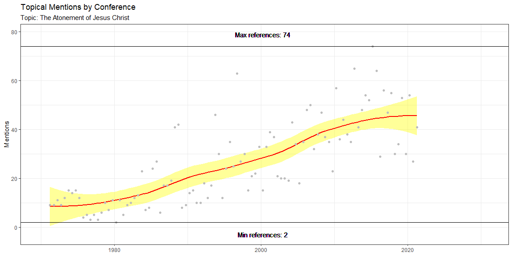
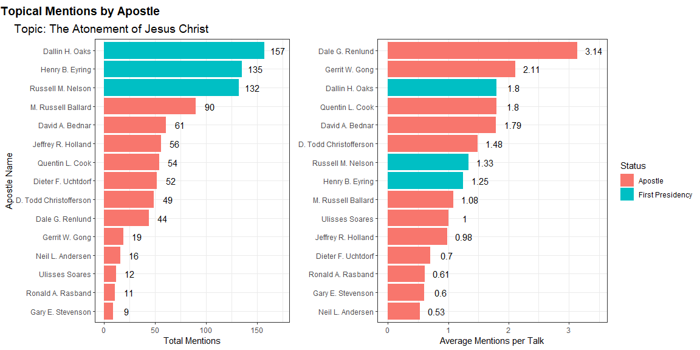
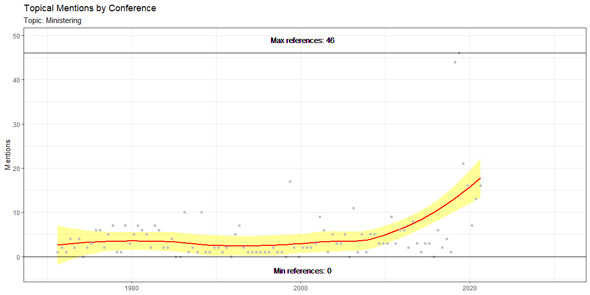
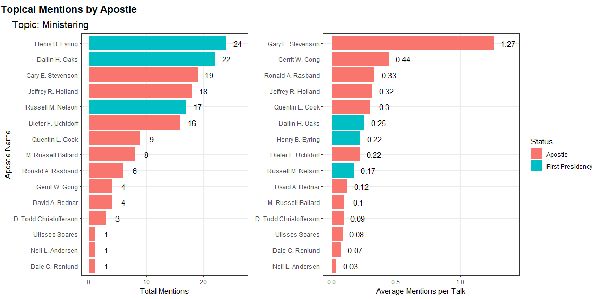
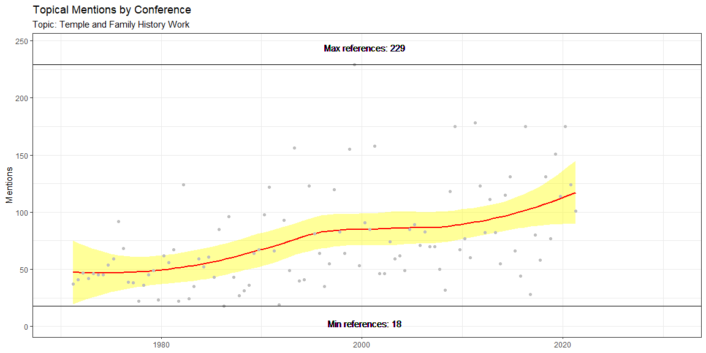
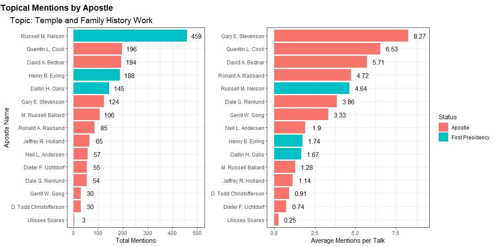

```r
# Use this R-Chunk to import all your datasets!
load("C:/Users/12088/Documents/Important/BYUI/2021-03-Fall/06-TLP/Practicum/ldsconf.rda")
```

## Background

For my final project, I wanted to analyze the words of general conference and explore trends over time, as well as how the apostles stack up to each other in terms of references made to certain topics. In specific, the topics I chode to analyze were Ministering, the Atonement of Jesus Christ, and Temple and Family History Work.

## Data Wrangling


```r
# Use this R-Chunk to clean & wrangle your data!
alltalks <- genconf %>%
  unnest(sessions) %>%
  select(-session_url) %>%
  unnest(talks) %>%
  mutate(
    title1 = case_when(
      url=="https://www.churchofjesuschrist.org/study/general-conference/2011/04/finding-joy-through-loving-service"~"Finding Joy through Loving Service",
      url=="https://www.churchofjesuschrist.org/study/general-conference/2005/04/our-most-distinguishing-feature"~"Our Most Distinguishing Feature",
      url=="https://www.churchofjesuschrist.org/study/general-conference/2001/04/focus-and-priorities"~"Focus and Priorities",
      url=="https://www.churchofjesuschrist.org/study/general-conference/1986/10/a-father-speaks"~"A Father Speaks",
      url=="https://www.churchofjesuschrist.org/study/general-conference/1983/04/receiving-a-prophet"~"Receiving a Prophet",
      url=="https://www.churchofjesuschrist.org/study/general-conference/1981/04/blessings-in-self-reliance"~"Blessings in Self Reliance",
      url=="https://www.churchofjesuschrist.org/study/general-conference/1979/10/the-role-of-a-bishop-in-the-church-welfare-program"~"The Role of a Bishop in the Church Welfare Program",
      TRUE~title1),
    author1 = case_when(
      title1=="Finding Joy through Loving Service"~"M. Russell Ballard",
      title1=="Our Most Distinguishing Feature"~"Jeffrey R. Holland",
      title1=="Focus and Priorities"~"Dallin H. Oaks",
      title1=="A Father Speaks"~"George I. Cannon",
      title1=="Receiving a Prophet"~"Loren C. Dunn",
      title1=="Blessings in Self Reliance"~"Mark E. Petersen",
      title1=="The Role of a Bishop in the Church Welfare Program"~"Marion G. Romney",
      TRUE~author1)) %>%
  select(date, session_id, session_name,
         title1, author1, paragraphs) %>%
  unnest(paragraphs) %>%
  filter(is_header == FALSE) %>%
  select(-c(section_num, p_num, p_id, is_header)) %>%
  mutate(author1 = case_when(
          str_detect(author1, ",")~sub(",.*","",author1),
          TRUE ~ author1),
         author1 = case_when(
          str_detect(author1,"^By ")~sub(".*By ","",author1),
          TRUE ~ author1),
         author1 = case_when(
           str_detect(author1,"^Sister ")~sub(".*Sister ","",author1),
           str_detect(author1,"^Brother ")~sub(".*Brother ","",author1),
           str_detect(author1,"^President ")~sub(".*President ","",author1),
           str_detect(author1,"^Elder ")~sub(".*Elder ","",author1),
           TRUE ~ author1))

wc <- function(word){
  alltalks %>%
    mutate(word_count = str_count(paragraph, regex(word, ignore_case = T)),
           the_word = word) %>%
    select(date, title1, author1, word_count, the_word) %>%
    group_by(date, title1, author1, the_word) %>%
    summarise(total = sum(word_count))
}

conf_count <- function(wc){
  wc %>%
  group_by(date) %>%
  summarise(conf_tot = sum(total)) %>%
  mutate(min_n = min(conf_tot),
         max_n = max(conf_tot)) %>%
  mutate(max_date = case_when(conf_tot == max_n~date),
         min_date = case_when(conf_tot == min_n~date))
}

ap_count <- function(wc,search,apostle){
  wc %>%
  mutate(auth = str_count(author1, regex(search, ignore_case = T))) %>%
  filter(auth == 2) %>%
  mutate(author1 = case_when(TRUE~apostle)) %>%
  mutate(count = n()) %>%
  group_by(author1) %>%
  summarise(ap_tot = sum(total),
            num_talks = sum(count))
}

ap_names <- c(
c('Russell|Nelson','Russell M. Nelson'),
c('Dallin|Oaks','Dallin H. Oaks'),
c('Henry|Eyring','Henry B. Eyring'),
c('Russell|Ballard','M. Russell Ballard'),
c('Jeffrey|Holland','Jeffrey R. Holland'),
c('Dieter|Uchtdorf','Dieter F. Uchtdorf'),
c('David|Bednar','David A. Bednar'),
c('Quentin|Cook','Quentin L. Cook'),
c('Todd|Christofferson','D. Todd Christofferson'),
c('Neil|Andersen','Neil L. Andersen'),
c('Ronald|Rasband','Ronald A. Rasband'),
c('Gary|Stevenson','Gary E. Stevenson'),
c('Dale|Renlund','Dale G. Renlund'),
c('Gerrit|Gong','Gerrit W. Gong'),
c('Ulisses|Soares','Ulisses Soares'))

first_pres <- c("Russell M. Nelson","Dallin H. Oaks","Henry B. Eyring")

apostles <- function(words){
  bind_rows(words %>% wc() %>% ap_count(ap_names[1],ap_names[2]),
            words %>% wc() %>% ap_count(ap_names[3],ap_names[4]),
            words %>% wc() %>% ap_count(ap_names[5],ap_names[6]),
            words %>% wc() %>% ap_count(ap_names[7],ap_names[8]),
            words %>% wc() %>% ap_count(ap_names[9],ap_names[10]),
            words %>% wc() %>% ap_count(ap_names[11],ap_names[12]),
            words %>% wc() %>% ap_count(ap_names[13],ap_names[14]),
            words %>% wc() %>% ap_count(ap_names[15],ap_names[16]),
            words %>% wc() %>% ap_count(ap_names[17],ap_names[18]),
            words %>% wc() %>% ap_count(ap_names[19],ap_names[20]),
            words %>% wc() %>% ap_count(ap_names[21],ap_names[22]),
            words %>% wc() %>% ap_count(ap_names[23],ap_names[24]),
            words %>% wc() %>% ap_count(ap_names[25],ap_names[26]),
            words %>% wc() %>% ap_count(ap_names[27],ap_names[28]),
            words %>% wc() %>% ap_count(ap_names[29],ap_names[30])) %>%
    mutate(avg_mentions = ap_tot/num_talks,
           Status = case_when(author1 %in% first_pres~"First Presidency",
                           TRUE~"Apostle"))
}
```

## Data Visualization Functions


```r
# Use this R-Chunk to plot & visualize your data!
date_window = c(as.Date('1970-04-01'),
                as.Date('2030-10-01'))

plot_conf <- function(dat, topic){
  ggplot(data = dat,
         mapping = aes(x = date,
                       y = conf_tot)) +
    geom_smooth(color = "red",
                fill = "yellow") +
    geom_point(color = "gray") +
    geom_hline(aes(yintercept = min_n)) +
    geom_hline(aes(yintercept = max_n)) +
    geom_text(aes(x = as.Date('2000-04-01'),
                  y = min_n - (max_n / 15),
                  label = paste0("Min references: ",min_n))) +
    geom_text(aes(x = as.Date('2000-04-01'),
                  y = max_n + (max_n / 15),
                  label = paste0("Max references: ",max_n))) +
    scale_x_date(limits = date_window) +
    theme_bw() +
    labs(title = "Topical Mentions by Conference",
         subtitle = paste0("Topic: ", topic),
         y = "Mentions") +
    theme(axis.title.x = element_blank())
}

plot_ap <- function(dat, measure){
  ggplot(data = dat,
       mapping = aes(x = measure,
                     y = fct_reorder(author1,measure),
                     fill = Status)) +
  geom_col() +
  geom_text(data = dat,
            aes(x = measure + (max(measure) * 0.1),
                y = author1,
                label = paste0(round(measure,2),"  "))) +
  theme_bw() +
  labs(y = "Apostle Name")
}

ap_plot <- function(dat, topic){
  total <- plot_ap(dat, dat$ap_tot) +
    labs(x = "Total Mentions") +
    theme(legend.position = "none")
  avg <- plot_ap(dat, dat$avg_mentions) +
    labs(x = "Average Mentions per Talk") +
    theme(axis.title.y = element_blank())
  ggdraw() +
    draw_plot(total, x = 0, y = 0, width = .42, height = 0.9) +
    draw_plot(avg, x = .42, y = 0, width = .58, height = 0.9) +
    draw_label("Topical Mentions by Apostle",
                fontface = 'bold', x = 0,
                hjust = 0, y = 0.97) +
    draw_label(paste0("Topic: ", topic),
               x =0.02, hjust = 0, y = 0.92)
}
```

## Visualizations


```r
atonement <- 'atonement|atone|atoning'
hist_atonement <- atonement %>% wc() %>% conf_count()
plot_conf(hist_atonement, "The Atonement of Jesus Christ")
```

<!-- -->

```r
ap_atonement <- atonement %>% apostles()
ap_plot(ap_atonement, "The Atonement of Jesus Christ")
```

<!-- -->

```r
ministering <- 'ministering'
hist_ministering <- ministering %>% wc() %>% conf_count()
plot_conf(hist_ministering, "Ministering")
```

<!-- -->

```r
ap_ministering <- ministering %>% apostles()
ap_plot(ap_ministering, "Ministering")
```

<!-- -->

```r
temple <- 'family history|geneology|temple|spirit of elijah|sealing'
hist_temple <- temple %>% wc() %>% conf_count()
plot_conf(hist_temple, "Temple and Family History Work")
```

<!-- -->

```r
ap_temple <- temple %>% apostles()
ap_plot(ap_temple, "Temple and Family History Work")
```

<!-- -->

## Conclusions

I was intrigued by some of the insights I found as I performed this analysis. First, I was shocked to see how the references to the Atonement have increased drastically in recent years. I know that the prophet has put an emphasis on the Savior recently, but I did not expect to see such an upward trend in references to the Atonement in conference. The words I searched for in this case were "Atonement, Atone and Atoning". I was less surprised to see an increase in references to ministering and temple work, as there have been many changes recently that have lead to those trends.

Regarding how the apostles stack up, I was impressed to see that on the total mentions, the First Presidency wasn't always on top. In fact, regarding Temple and Family History work, Elder Cook and Elder Bednar have more mentions than President Oaks and President Eyring, despite both of them being called to Apostleship long after the First Presidency counselors, and only giving one talk per conference versus the 1-3 typically given by First Presidency members. I was less surprised by the average mentions per talk of each subject, as the apostles with fewer talks often had more references to each subject. For example, if Elder Gong, who only has 10 talks, speaks on one topic in his next talk, his average mentions on that topic is bound to be higher than someone like President Nelson, who has given over 100 talks.

Overall, I learned a lot from this project and was fascinated to dig into the data. I am pretty proud of the functions I was able to write, as well as my experimenting with cowplot. I'm grateful for the skills I've acquired over the course of the semester and I look forward to continuing to hone in my skills.
